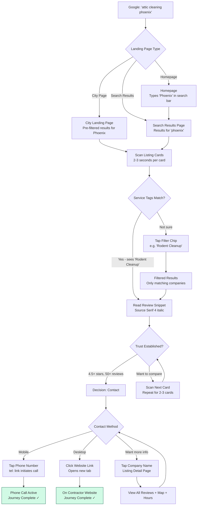
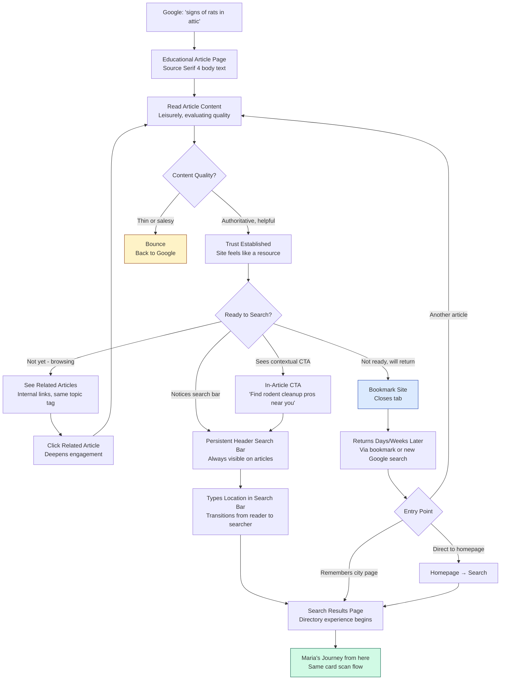
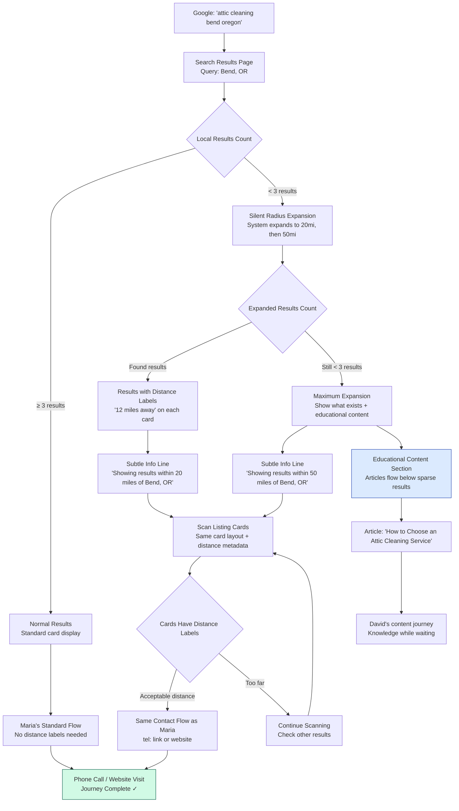
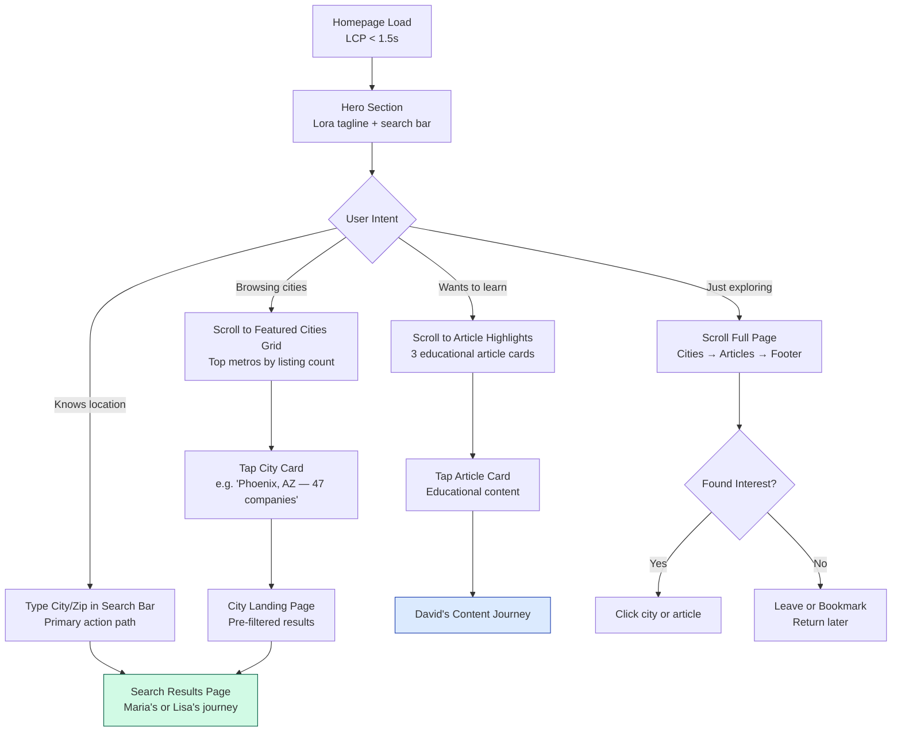

# UX Design Specification - atticcleaning-website

**Author:** Jon
**Date:** 2026-02-11

---

## Executive Summary

### Project Vision

AtticCleaning.com is a search-first national directory and content authority for the attic cleaning services industry. The UX is built around a single core flow: search → scan results → evaluate listing → contact contractor — completed in under 5 minutes. Every design decision optimizes for this flow while supporting a secondary content-discovery path that converts educational readers into directory users. Mobile-first, SEO-driven, statically generated — performance and discoverability are primary UX constraints.

### Target Users

**Maria (Reactive Homeowner — Primary):** Urgent problem, zero industry knowledge, searching on mobile at her kitchen table after dinner. Emotional state: scared, uncertain, needs calm competence from the first pixel. Needs instant clarity: who's nearby, what do they specialize in, are they well-reviewed? Arrives via Google organic result to a city landing page or search results. Success = phone call to a qualified specialist in under 5 minutes.

**David (Research Homeowner — Secondary):** Curious but not urgent, likely desktop. Arrives via educational article from organic search. Browses content, bookmarks, returns weeks/months later to use the directory. Success = seamless transition from educational content to directory search when ready.

**Lisa (Edge Case Homeowner):** Thin coverage area, rural/small city. The system must adapt invisibly — auto-expanding search radius with distance labels, surfacing educational content as a natural continuation. No error states, no apology language. Success = same quality experience as Maria, just with distance context added.

### Key Design Challenges

1. **5-minute search-to-contact flow:** Listing cards must convey trust signals (ratings, review snippets, service tags) at a glance. Every interaction — search, filter, sort, compare — must be immediate and intuitive.
2. **Invisible graceful degradation:** Radius expansion and content fallback must feel seamless, not like an error state. Silent expansion with distance labels and a subtle info line. Educational articles flow below results naturally.
3. **Content-to-directory conversion:** Educational articles must naturally thread directory connections without feeling like ads. Contextual CTAs, local company mentions, and clear navigation to search.
4. **Three-font performance budget:** 140KB total font weight, zero CLS, LCP < 1.5s on mobile 4G. Font loading strategy constrains typography choices — critical fonts preloaded, accent font swapped async.
5. **Mobile-first completeness:** Mobile is the primary design target. Not a degraded desktop — every feature must be equally usable. Touch targets 44x44px minimum, thumb-reachable CTAs, full-width cards.

### Design Opportunities

1. **Service tag chips as visual triage:** Colored service tags create instant scanability on listing cards — homeowners spot their exact service need without reading. This is the core "aha moment" differentiator vs. generic directories.
2. **Trust through data density:** Star rating + review count + review snippet + service tags on a single card. The density itself communicates a rich, curated resource — not a thin directory.
3. **Three-font typographic zones:** Lora accent for editorial moments (hero tagline, pull quotes), Jakarta Sans for all UI elements (cards, nav, buttons, tags), Source Serif 4 for body content (review snippets, article text). The font contrast reinforces information hierarchy — review snippets in Source Serif feel like a real person's words, not another UI element.
4. **City landing pages as dual-purpose anchors:** Programmatic city pages serve SEO targeting AND provide a curated local directory view with aggregated data.

### Key UX Decisions

1. **Listing card: pure signal, no map.** Company name, star rating + review count, service tag chips, review snippet (Source Serif 4), distance label only on radius expansion. No images, no map thumbnail. The card is information density, not visual decoration.
2. **Radius expansion: silent and seamless.** Same card layout with distance labels added. Subtle info line: "Showing results within 20 miles of [location]." Educational articles flow below as a natural section. No error states, no "sorry" language.
3. **Homepage featured cities: data-driven.** Top metros by listing count, auto-generated at build time. Zero maintenance, scales automatically as metros expand.
4. **Homepage layout:** Hero with Lora tagline + prominent search bar → featured city grid → educational content highlights (3-4 articles) → footer. Search bar above the fold on mobile.

## Core User Experience

### Defining Experience

The core product experience is the listing card scan. The search bar is the entry point. The contact action is the outcome. But the listing card is where the product delivers its value — in 2-3 seconds, a homeowner must be able to assess: does this company handle my problem, are they well-reviewed, and are they nearby? Every UX decision flows from making this card scan effortless and information-rich.

The primary user flow is linear and short: search → scan results → evaluate listing → contact. Four steps, four page types, under 5 minutes. No account creation, no login walls, no multi-step forms. The directory is open and immediate.

### Platform Strategy

- **Platform:** Web-only, responsive. No native app, no PWA, no offline requirements.
- **Primary input:** Touch (mobile). Secondary: mouse/keyboard (desktop).
- **Interactive elements:** Search input, service-type filter toggles, sort controls, map embed (listing detail page only). Everything else is static rendered content.
- **JavaScript budget:** Minimal. JS only for search interactions, filter/sort toggles, and Google Maps embed on listing detail pages. No client-side routing, no SPA behavior. Full page loads for SEO crawlability.
- **Breakpoints:** Mobile-first (< 768px) → Tablet (768-1024px) → Desktop (> 1024px). Mobile is the complete experience; tablet and desktop add layout density, not features.

### Effortless Interactions

| Interaction | Design Goal | Friction Eliminated |
|---|---|---|
| Search | Type zip/city, hit enter, see results | No account, no location permission, no wizard |
| Filter by service | Tap a chip, results update instantly | Single-tap toggle with visible state change |
| Sort results | Tap sort option, results reorder | Default sort by rating, alternatives one tap away |
| Contact contractor | Tap phone number or website link | `tel:` link on mobile, new tab for website |
| Radius expansion | Automatic when < 3 results | User does nothing — system adapts silently |
| Content to directory | Search bar visible on every article page | One action to switch from reading to searching |
| City browsing | Tap featured city on homepage | Direct link to city landing page with local results |

### Critical Success Moments

1. **"This site gets my problem" (Second 3):** Maria sees service tag chips — "Rodent Cleanup," "Decontamination" — on listing cards within 3 seconds of landing. This specificity doesn't exist on Yelp, Google, or HomeAdvisor. This is the "aha moment."
2. **"I can trust these results" (Second 10):** Star ratings with real review counts and a snippet of an actual person's review in Source Serif 4. The data density signals a curated resource, not a thin directory.
3. **"This was fast" (Minute 4):** Maria calls a contractor. Search to phone call in under 5 minutes. The speed itself builds confidence in the decision.
4. **"No dead end" (Any time):** Lisa in rural Oregon gets useful results — radius expanded silently, distance labels added, educational articles surfaced below. The site adapted to her situation.
5. **"I'll come back" (Session end):** David bookmarks the site after reading an educational article. The content established authority. When he's ready to hire, the directory is waiting.

### Experience Principles

1. **Pure signal, zero noise.** Every element on screen must earn its place. No ads, no lead-gen forms, no account prompts, no visual clutter. The listing card is data, not decoration.
2. **The site adapts to you.** Radius expansion, educational content fallback, distance labels — the system responds to the user's situation without asking. No configuration, no preferences, no dead ends.
3. **Trust through transparency.** Real Google ratings, real review snippets, real review counts. No fake reviews, no "featured" pay-to-play listings (in MVP), no hidden agendas. The data speaks.
4. **Speed is a feature.** LCP < 1.5s. Search-to-contact < 5 minutes. Every interaction instant. Static pages from CDN. Performance isn't a technical metric — it's a trust signal.
5. **Content earns the conversion.** Educational articles don't push the directory — they build authority. The conversion from reader to searcher happens because the user trusts the resource, not because they were funneled.

## Desired Emotional Response

### Primary Emotional Goals

**1. Calm Competence (Maria — First 3 Seconds)**
Maria arrives scared. She heard scratching in her attic. She doesn't know what attic cleaning costs, who to call, or whether she's being scammed. The site's first job is emotional regulation — not excitement, not delight, but *calm*. Clean layout, immediate specificity (service tag chips matching her problem), and real data (star ratings, review counts) signal: "You're in the right place. We know what we're doing." The emotional shift: scared → reassured.

**2. Quiet Authority (David — First 30 Seconds)**
David isn't stressed — he's curious. He arrived from an educational article about attic insulation. The site must feel like a knowledgeable resource, not a sales funnel. Source Serif 4 body text, substantive content, and a search bar that waits patiently rather than screaming for attention. The emotional shift: curious → trusting.

**3. Invisible Belonging (Lisa — Throughout)**
Lisa searches from rural Oregon and gets fewer results. She must never feel like a second-class user. Silent radius expansion with distance labels, educational articles flowing below naturally — the system treats her situation as normal, not exceptional. The emotional shift: potential isolation → quiet inclusion.

### Emotional Journey Mapping

| Stage | Maria (Urgent) | David (Research) | Lisa (Thin Coverage) | Target Emotion |
|---|---|---|---|---|
| **Discovery** | Google → city page. Anxious, scanning fast | Google → article. Leisurely, evaluating | Google → search results. Hopeful | Immediate relevance |
| **First Impression** | Clean, specific, data-dense cards | Authoritative content, clear navigation | Results present (radius expanded silently) | Calm competence |
| **Core Action** | Scanning listing cards for her service need | Reading article, noticing directory integration | Scanning cards with distance context | Confident clarity |
| **Decision Point** | Comparing 2-3 contractors by ratings + reviews | Bookmarking, noting search bar for later | Evaluating fewer but still quality options | Empowered choice |
| **Completion** | Taps phone number, calls contractor | Closes tab, plans to return | Calls contractor, notes distance | Relief + control |
| **Post-Action** | "That was fast. I handled it." | "I'll come back when I'm ready." | "They serve my area too." | Accomplishment |

### Micro-Emotions

**Critical emotional states to design for:**

| Micro-Emotion | Context | Design Response |
|---|---|---|
| **Confidence vs. Confusion** | Maria scanning listing cards | Service tag chips create instant visual triage — she spots her exact need without reading paragraphs |
| **Trust vs. Skepticism** | Evaluating contractor quality | Real Google ratings + review counts + actual review snippets in Source Serif 4 — data density signals authenticity |
| **Relief vs. Overwhelm** | Seeing search results | Clean card layout with pure signal. No ads, no pop-ups, no account walls. Breathing room in the design |
| **Inclusion vs. Isolation** | Lisa getting few local results | Silent radius expansion, distance labels as natural metadata, educational articles as a content continuation — never an error state |
| **Authority vs. Sales Pressure** | David reading educational content | Content earns trust through substance. Directory CTAs are contextual and calm, not aggressive |
| **Accomplishment vs. Doubt** | After contacting a contractor | Speed of the flow (< 5 minutes) reinforces the decision. "I found someone qualified, fast." |

### Design Implications

**Emotion-Design Connections:**

1. **Calm competence → Visual restraint.** Muted color palette, generous whitespace, no animation or visual noise. The design communicates seriousness — this isn't a playful app, it's a tool for someone with a real problem. Typography does the heavy lifting, not decoration.

2. **Trust → Data density on cards.** Star rating + review count + review snippet + service tags on a single card. The density *itself* is the trust signal. A sparse card feels like a thin directory; a dense card feels like a curated resource with real information behind it.

3. **Relief → Zero friction architecture.** No account creation, no login walls, no multi-step wizards. Search → results → contact. Every removed step is an anxiety removed. The `tel:` link on mobile means one tap from card to phone call.

4. **Inclusion → Invisible adaptation.** Radius expansion adds distance labels — it doesn't show error states or "sorry, no results" messages. The same card layout, the same visual quality, just with "12 miles away" added naturally. Lisa's experience has the same visual confidence as Maria's.

5. **Authority → Typographic zone separation.** Source Serif 4 for review snippets and article body — it reads as editorial, human, trustworthy. Jakarta Sans for UI elements — it reads as functional, clear, modern. Lora for hero taglines — it reads as established, confident. The fonts *feel* different, and that contrast reinforces the information hierarchy.

6. **Speed → Performance as emotional design.** LCP < 1.5s isn't a technical spec — it's the difference between Maria feeling "this site works" vs. "is this site even loading?" on her phone at the kitchen table. Static generation from CDN is an emotional design decision.

### Emotional Design Principles

1. **Reduce anxiety before adding information.** Maria is scared. The first job of every page is to feel calm, clean, and competent. Visual noise creates cognitive load, and cognitive load amplifies anxiety. Whitespace is therapeutic.

2. **Let data carry the trust.** Don't *tell* users to trust the results — show real ratings, real review counts, real review snippets. The numbers and words of real people are more persuasive than any design treatment or badge.

3. **Never make the user feel like an edge case.** Lisa doesn't see "No results found." She sees results with distance context. The system's adaptations are invisible — the emotional experience is consistent regardless of coverage density.

4. **Speed communicates respect.** A fast site says "we value your time." For Maria with an urgent problem, speed is emotional — it means she's closer to solving her problem. Every millisecond of load time is a millisecond of anxiety.

5. **Earn the transition, don't force it.** David moves from educational content to directory search on his own terms. The search bar is always visible but never pushy. The transition from reader to searcher happens because of trust, not because of a funnel.

## UX Pattern Analysis & Inspiration

### Inspiring Products Analysis

**1. Zillow — Data-Dense Search Cards**
Zillow solves the same core problem for a different vertical: scan a list, evaluate options, take action. Their property cards pack price, beds/baths, sqft, and status into a tight visual hierarchy that users parse in under 2 seconds. The listing card is the product — not the map, not the photos, but the structured data. What works: strict information hierarchy within a fixed card format, consistent data layout across thousands of listings, sort/filter that feels instant. What doesn't apply: heavy image reliance (our cards are text-data, not visual), map-first navigation (our entry point is search, not browse).

**2. Healthline — Content Authority to Action**
Healthline is the model for David's journey. Users arrive via Google to an educational article, build trust through substantive content, and naturally discover action paths (find a doctor, treatment options). The content doesn't feel like a funnel — it feels like a resource. What works: clean typography that prioritizes readability, contextual CTAs that feel like helpful next steps rather than ads, persistent but non-aggressive navigation to related content and tools. What doesn't apply: their content depth (we're lighter, more directory-focused), their ad model (we have none).

**3. Google Maps Local Results — Instant Relevance**
Google's local pack (the 3-result cards in search) is the benchmark for location-based directory UX. Business name, star rating, review count, category, distance — all in a single scannable line. Zero friction from search to result. What works: the radical simplicity of the card format, real Google ratings as the primary trust signal, distance as natural metadata rather than a separate filter, automatic radius/relevance handling. What doesn't apply: map-first interaction model, their ability to leverage location permissions (we use explicit zip/city input).

**4. Craigslist — Zero-Noise Information Architecture**
An unconventional inspiration, but Craigslist proves that stripping away visual decoration doesn't hurt utility-focused users. For Maria at her kitchen table, she wants *information*, not *experience*. Craigslist's radical simplicity — text links, no images, no design — works because the content is the interface. What works: the principle that removing design friction serves urgent users, category-based navigation that requires zero learning, instant page loads. What doesn't apply: their complete absence of trust signals (we need ratings, reviews, service tags), their lack of mobile optimization.

### Transferable UX Patterns

**Navigation Patterns:**

- **Search-first entry** (Google Maps) — Search bar is the hero element. No browse-first, no category tree. Type location, get results. This is our homepage and our primary interaction model.
- **Persistent search across contexts** (Healthline) — Search bar visible on article pages, city pages, and results pages. David reading an article can switch to directory search without navigating away mentally.
- **Flat city navigation** (Zillow) — Featured cities as direct links, not a drill-down hierarchy. One tap from homepage to city results. No state → city → neighborhood nesting.

**Interaction Patterns:**

- **Single-tap filter chips** (Google Maps) — Service type filters as tappable chips with visible active/inactive state. One tap to toggle, results update. No dropdown menus, no "Apply" buttons.
- **Sort as a single control** (Zillow) — One sort selector with 3 options (rating, review count, distance). Default is rating. Change is one tap. Results reorder instantly.
- **tel: link as primary CTA** (Google Maps local pack) — On mobile, the phone number is a tappable link. One tap from listing card to active phone call. This is the entire conversion funnel.

**Visual Patterns:**

- **Typographic hierarchy over visual decoration** (Craigslist principle, Healthline execution) — Font weight, size, and family create the visual hierarchy. No icons on cards, no thumbnails, no color blocks. The data *is* the design.
- **Star rating as visual anchor** (Google Maps, Zillow) — The gold star cluster is the first thing the eye hits on a card. It's a universal trust signal that requires zero learning.
- **Review snippet as social proof** (Google Maps) — A single sentence from a real review in a distinct typeface. It humanizes the listing and provides specific, scannable evidence. Source Serif 4 reinforces this — it reads as a quote, not as UI text.

### Anti-Patterns to Avoid

**1. Lead-gen walls (HomeAdvisor/Angi model):** "Get free quotes!" forms that require name, email, phone, project description before showing any results. This is the opposite of our zero-friction architecture. Maria wants to *see* contractors, not submit herself to be sold to. No forms, no gates, no data collection before value delivery.

**2. Pay-to-play result ordering (Yelp model):** "Sponsored" results that break trust in the sort order. Users who notice lose faith in all results. Our MVP has no paid placements — results are sorted by real data. If monetization comes later, it must be visually distinct and never pollute organic sort.

**3. Account walls before utility (Thumbtack model):** "Sign up to see pricing" or "Create an account to contact." Every account prompt is a user lost. Our directory is completely open — no accounts, no logins, no saved searches gating.

**4. Aggressive notification/email capture (most directories):** Pop-up modals, slide-in CTAs, "Subscribe for updates" overlays. These directly conflict with our "calm competence" emotional goal. Maria is already anxious — a pop-up amplifies that anxiety.

**5. Dead-end sparse results (generic directories):** "No results found. Try expanding your search." This error state is what we've designed out entirely with silent radius expansion. Lisa never sees this message — the system adapts invisibly.

**6. Over-designed listing cards (Houzz model):** Large images, multiple action buttons, save/share/compare icons, price estimate widgets. Visual complexity that slows the scan. Our cards are pure signal: name, rating, tags, snippet. Nothing else.

### Design Inspiration Strategy

**What to Adopt:**

- Zillow's card data density principle — fixed-format cards with consistent information hierarchy across all listings
- Google Maps' star rating as visual anchor — universal trust signal, no learning curve
- Healthline's content-to-action threading — contextual, calm CTAs within educational content
- Craigslist's zero-noise philosophy — in our case, applied to card design rather than the whole site
- Google Maps' `tel:` link pattern — one tap from card to phone call on mobile

**What to Adapt:**

- Zillow's sort/filter interaction — simplified to 3 sort options and service-type chip filters only (no price range sliders, no map toggle, no saved searches)
- Healthline's persistent navigation — adapted as a persistent search bar rather than a full nav menu. The search bar *is* the navigation
- Google Maps' radius handling — adapted as silent expansion with distance labels rather than a visual map radius change

**What to Avoid:**

- Any form of lead-gen or data capture before showing results — conflicts with zero-friction architecture
- Any paid/sponsored result mixing — conflicts with trust-through-transparency principle
- Any account or login requirement — conflicts with open, immediate access
- Any pop-up, modal, or overlay — conflicts with calm competence emotional goal
- Any image-heavy card design — conflicts with pure signal, data-density approach
- Any "no results" error state — conflicts with invisible adaptation principle

## Design System Foundation

### Design System Choice

**shadcn/ui + Tailwind CSS v4** — a headless, copy-paste component library built on Radix UI primitives, styled with Tailwind utility classes.

This falls in the **Themeable System** category — proven accessible components with full visual control. Unlike opinionated systems (Material Design, Ant Design), shadcn/ui provides unstyled primitives that we own completely. No fighting a framework's visual opinions to achieve our calm, data-dense aesthetic.

### Rationale for Selection

**1. Full visual ownership with zero compromise.**
shadcn/ui components are copied into the project — not imported from node_modules. We own every line of CSS. The three-font typographic system (Lora/Jakarta Sans/Source Serif 4), the muted color palette, the data-dense card layout — none of this conflicts with the component library because the library has no visual opinion.

**2. Accessibility built into the primitives.**
Radix UI primitives (the foundation of shadcn/ui) handle keyboard navigation, ARIA attributes, focus management, and screen reader compatibility. Our NFR target of WCAG 2.1 AA is achievable without custom accessibility work on core interactive elements (search input, filter chips, sort controls).

**3. Performance-aligned architecture.**
shadcn/ui components are tree-shakeable by nature — we only include what we use. No 200KB component library bundle for a site that needs 5 interactive components. Combined with Tailwind's purge, the CSS output is minimal. This directly supports our < 500KB page weight and < 1.5s LCP targets.

**4. Tailwind CSS v4 utility-first approach.**
Utility classes eliminate CSS specificity wars and enable responsive design without media query files. Mobile-first breakpoints (`sm:`, `md:`, `lg:`) are built into the class system. The three-breakpoint strategy (< 768px, 768-1024px, > 1024px) maps directly to Tailwind's default breakpoints.

**5. Next.js App Router compatibility.**
shadcn/ui components are designed for React Server Components. Interactive elements (search, filters, sort) use client components; everything else renders server-side. This aligns with our minimal-JS, static-generation-first architecture.

### Implementation Approach

**Component inventory (MVP):**

| Component | Source | Customization Level |
|---|---|---|
| Search input | shadcn/ui `Input` | Styled with Jakarta Sans, prominent sizing, search icon |
| Filter chips | Custom on Tailwind | Service-type toggles with color-coded active states |
| Sort selector | shadcn/ui `Select` | 3 options (rating, reviews, distance), minimal styling |
| Listing card | Custom on Tailwind | Data-dense layout, three-font zones, no shadcn dependency |
| Star rating display | Custom on Tailwind | Gold star SVGs + review count, read-only (not interactive) |
| Navigation bar | Custom on Tailwind | Logo + persistent search bar, minimal links |
| Footer | Custom on Tailwind | City links, content links, standard footer layout |
| Google Maps embed | Native embed | Listing detail page only, lazy-loaded |

**Key architectural decisions:**

- **Listing card is fully custom.** The core product element doesn't use shadcn/ui components — it's a pure Tailwind layout optimized for data density and scan speed. No component library abstraction between us and the card's pixel-level control.
- **Interactive elements use shadcn/ui primitives.** Search input, sort selector, and any future form elements benefit from Radix's accessibility primitives.
- **Filter chips are custom.** Service-type chip toggles need specific color-coded states and touch-target sizing (44x44px) that are easier to build directly than to adapt from a generic component.

### Customization Strategy

**Design tokens (Tailwind CSS v4 theme):**

- **Colors:** Muted, professional palette. No bright primaries. Gold for star ratings. Subtle chip colors for service types. High contrast for text (WCAG AA minimum 4.5:1).
- **Typography:** Three-font system configured as Tailwind font families — `font-display` (Lora), `font-sans` (Plus Jakarta Sans), `font-serif` (Source Serif 4). Font sizes follow a constrained scale optimized for card readability.
- **Spacing:** Generous whitespace on cards (supports "calm competence" emotional goal). Tight internal card spacing for data density. Touch targets minimum 44x44px.
- **Breakpoints:** Default Tailwind breakpoints (`sm: 640px`, `md: 768px`, `lg: 1024px`) map to our mobile/tablet/desktop strategy.
- **Shadows/borders:** Minimal. Cards use subtle borders or light shadows — not heavy elevation. The design is flat and clean, not layered.

**Font loading strategy:**

1. Plus Jakarta Sans (UI font) — preloaded, critical render path. Used for all interactive elements, navigation, headings.
2. Source Serif 4 (body font) — preloaded, critical render path. Used for review snippets, article body text.
3. Lora (accent font) — async swap. Used only for hero tagline and editorial pull quotes. Non-blocking.
4. Total budget: ~140KB across all three fonts (subset to Latin characters, limited weight range).

## Defining Experience Deep Dive

### The One Interaction

**"Scan a listing card and know if this contractor handles my problem."**

If we nail this single interaction, everything else follows. The search bar gets users to the cards. The contact action gets them to the phone call. But the listing card scan is where the product delivers its value — in 2-3 seconds, a homeowner assesses: *Does this company handle my specific problem? Are they well-reviewed? Are they nearby?*

The equivalent "describe it to a friend" statement: *"It's like Google Maps results but specifically for attic cleaning — you see the ratings, what they specialize in, and a real review, all on one card."*

### User Mental Model

**How users currently solve this problem:**
Maria Googles "attic cleaning near me." She gets a mix of Google Maps results (3-pack), Yelp links, HomeAdvisor lead-gen pages, and random local business websites. She opens 4-5 tabs, cross-references reviews, tries to figure out which companies handle her specific issue (rodent cleanup vs. insulation vs. general cleaning), and spends 20-30 minutes before making a call — if she doesn't give up first.

**The mental model they bring:**
Users arrive with a Google/Yelp mental model — type a location, see a list of businesses with star ratings. This is familiar. They expect to scan, compare, and choose. They do NOT expect to fill out forms, create accounts, or answer project questionnaires before seeing results.

**Where they get confused with existing solutions:**
- HomeAdvisor/Angi: "I just wanted to see companies, not submit my phone number to three contractors"
- Yelp: "Half the results are general contractors, not attic specialists. How do I know who does rodent cleanup specifically?"
- Google Maps: "The reviews are generic — I can't tell if they handle my exact problem"

**What AtticCleaning.com changes:**
The service tag chips solve the specificity gap. "Rodent Cleanup," "Insulation Removal," "Decontamination" — these are visible on every card, instantly answering "do they handle my problem?" before the user reads a single word. No other directory in this vertical provides this level of service-type visibility at the card level.

### Success Criteria

**The listing card scan succeeds when:**

| Criterion | Measurement | Target |
|---|---|---|
| Service relevance is instant | User can identify if company handles their problem | < 2 seconds per card |
| Trust is established quickly | Star rating + review count + snippet parsed together | < 3 seconds per card |
| Comparison is effortless | User can compare 3 cards without scrolling back | All cards in identical layout |
| Contact is one action away | Phone number or website link visible on card | Zero additional clicks to initiate contact |
| No dead-end cards | Every card has rating, at least one service tag, and a review snippet | 100% data completeness on displayed cards |

**Users feel successful when:**
- They can say "I found 3 companies that specifically do [my problem] and they're all well-rated" within 2 minutes of landing
- The phone call happens without any intermediate steps (no forms, no accounts, no "request a quote" flows)
- They feel like they made an informed choice, not a random one

### Novel vs. Established Patterns

**Established patterns we adopt (zero learning curve):**
- Search bar with location input → results list (Google Maps model)
- Star rating + review count as primary trust signal (universal pattern)
- Sort controls for reordering results (Zillow/Amazon model)
- `tel:` link for one-tap mobile calling (Google Maps local pack)
- Card-based results layout (every modern directory)

**Our innovation within familiar patterns:**
- **Service tag chips on listing cards.** This is the differentiator. No other attic cleaning directory (or most service directories) surfaces service-type specificity at the card level. Users instantly see "Rodent Cleanup," "Insulation Removal," "Mold Remediation" without clicking into a detail page. This is a novel data element within a familiar card pattern — zero learning curve, immediate value.
- **Review snippet in a distinct typeface.** Source Serif 4 for the review snippet creates a visual "this is a real person's words" signal that's subtly different from the Jakarta Sans UI text around it. The font change is the design innovation — it adds a human quality to a data-dense card without any extra space or decoration.
- **Silent radius expansion.** Users don't learn this pattern — they never see it. The system adapts invisibly. The "innovation" is the absence of a failure state, which is unusual for search-based products.

**No novel patterns requiring education.** Every interaction uses a pattern homeowners already know from Google, Yelp, Amazon, or Zillow. The innovation is in what data we show, not how users interact with it.

### Experience Mechanics

**1. Initiation — Search:**

- **Entry point:** Search bar is the hero element on homepage. On city landing pages, it's pre-filled with the city. On article pages, it's in the persistent header.
- **Input:** User types a zip code or city name. Autocomplete is optional (nice-to-have, not MVP). Hit enter or tap search button.
- **System response:** Full page load to search results page (not SPA — SEO-first architecture). Results render server-side. LCP target: < 1.5s.

**2. Interaction — Card Scan:**

- **Layout:** Vertical stack of listing cards, full-width on mobile, 2-column on desktop. Each card is identical in structure.
- **Card anatomy (top to bottom):**
  1. Company name (Jakarta Sans, semibold, largest text)
  2. Star rating (gold stars) + review count ("4.7 ★ (142 reviews)")
  3. Service tag chips (colored, horizontally scrollable if > 3)
  4. Review snippet (Source Serif 4, italic, 1-2 lines, truncated with ellipsis)
  5. Distance label (only when radius expanded, e.g., "12 miles away")
- **Scan behavior:** User's eyes move top-to-bottom on each card: name → rating → tags → snippet. 2-3 seconds per card. Service tags are the decision accelerator — they answer "do they handle my problem?" before the user reads the snippet.

**3. Feedback — Filtering & Sorting:**

- **Filter chips:** Service-type chips above results. Tap to toggle. Active chips are filled/colored, inactive are outlined. Results filter instantly (client-side JS on the pre-rendered list). Visual state change confirms the action.
- **Sort control:** Single selector. Default: highest rating. Options: rating, review count, distance. One tap to change, results reorder. No "Apply" button.
- **Result count:** Subtle text above cards: "12 attic cleaning companies in Phoenix, AZ" — confirms the search worked and provides context.

**4. Completion — Contact:**

- **Phone number:** Visible on the listing card (or one tap to detail page). On mobile, it's a `tel:` link — tap to call. This is the primary conversion action.
- **Website link:** Opens in new tab. Secondary action for users who want more info before calling.
- **Detail page (optional path):** User taps company name to see full listing — all reviews, map embed, full service list, business hours. But the card provides enough information for most users to act without visiting the detail page.
- **Success signal:** The phone call itself. No confirmation page, no "request sent" state. The user's phone rings, and they're talking to a contractor. Done.

## Visual Design Foundation

### Color System

**Design principle:** Muted, professional, and calm. The color palette supports the "calm competence" emotional goal — no bright primaries competing for attention. Color is used sparingly and functionally: gold for star ratings, subtle tints for service tag chips, high-contrast text for readability.

**Semantic Color Palette:**

| Token | Role | Value | Usage |
|---|---|---|---|
| `--background` | Page background | `#FAFAF8` | Warm off-white. Not pure white (too clinical) or cream (too warm). Subtle warmth says "professional, not sterile." |
| `--foreground` | Primary text | `#1A1A1A` | Near-black. High contrast on off-white background (15.4:1 ratio). All body text and headings. |
| `--muted` | Secondary text | `#6B6B6B` | Review counts, distance labels, metadata. Still meets AA contrast on background (4.8:1). |
| `--border` | Card borders, dividers | `#E5E5E0` | Subtle warm gray. Cards have borders, not shadows — flat and clean. |
| `--accent` | Star ratings | `#D4A017` | Gold. Universal "rating" color. Used only for star icons. Not amber (too orange) or yellow (too bright). |
| `--primary` | Search button, active states | `#2563EB` | Blue. Trustworthy, professional. Used sparingly — search button, active sort, focused inputs. |
| `--primary-foreground` | Text on primary | `#FFFFFF` | White text on blue backgrounds. |
| `--destructive` | Error states (rare) | `#DC2626` | Red. Only for form validation errors on search input. Almost never visible. |
| `--card` | Card background | `#FFFFFF` | Pure white cards on off-white page background. Subtle lift without shadows. |

**Service Tag Chip Colors:**
Muted tints — not saturated colors. Each service type gets a distinct but soft background with darker text. The chips should be scannable but not visually loud.

| Service Type | Background | Text |
|---|---|---|
| Rodent Cleanup | `#FEF3C7` (warm yellow tint) | `#92400E` |
| Insulation Removal | `#DBEAFE` (cool blue tint) | `#1E40AF` |
| Decontamination | `#FCE7F3` (soft pink tint) | `#9D174D` |
| Mold Remediation | `#D1FAE5` (soft green tint) | `#065F46` |
| General Cleaning | `#F3F4F6` (neutral gray tint) | `#374151` |
| Attic Restoration | `#EDE9FE` (soft purple tint) | `#5B21B6` |

**Color usage rules:**
- No gradients anywhere. Flat colors only.
- No colored backgrounds on sections. White cards on off-white page.
- Blue (`--primary`) appears only on interactive elements — never decorative.
- Gold (`--accent`) appears only on star ratings — never decorative.
- Service tag chip colors are the only "colorful" element on listing cards.

### Typography System

**Three-font architecture:**

| Font | Tailwind Class | Role | Weights | Loading |
|---|---|---|---|---|
| Plus Jakarta Sans | `font-sans` | UI: headings, nav, buttons, labels, card company names, filter chips | 500 (medium), 600 (semibold), 700 (bold) | Preload, critical path |
| Source Serif 4 | `font-serif` | Content: review snippets, article body text, pull quotes | 400 (regular), 400 italic | Preload, critical path |
| Lora | `font-display` | Accent: hero tagline, editorial moments | 500 (medium), 500 italic | Async swap, non-blocking |

**Type Scale (mobile-first):**

| Element | Font | Size (mobile) | Size (desktop) | Weight | Line Height |
|---|---|---|---|---|---|
| Hero tagline | Lora | 28px / 1.75rem | 40px / 2.5rem | 500 | 1.2 |
| Page heading (h1) | Jakarta Sans | 24px / 1.5rem | 32px / 2rem | 700 | 1.25 |
| Section heading (h2) | Jakarta Sans | 20px / 1.25rem | 24px / 1.5rem | 600 | 1.3 |
| Card company name | Jakarta Sans | 18px / 1.125rem | 18px / 1.125rem | 600 | 1.3 |
| Card rating text | Jakarta Sans | 14px / 0.875rem | 14px / 0.875rem | 500 | 1.4 |
| Service tag chip | Jakarta Sans | 12px / 0.75rem | 13px / 0.8125rem | 500 | 1 |
| Review snippet | Source Serif 4 | 14px / 0.875rem | 15px / 0.9375rem | 400 italic | 1.5 |
| Body text (articles) | Source Serif 4 | 16px / 1rem | 18px / 1.125rem | 400 | 1.65 |
| Distance label | Jakarta Sans | 13px / 0.8125rem | 13px / 0.8125rem | 500 | 1.4 |
| Result count / meta | Jakarta Sans | 14px / 0.875rem | 14px / 0.875rem | 400 | 1.4 |

**Font loading budget:**

| Font | Characters | Weights | Estimated Size |
|---|---|---|---|
| Plus Jakarta Sans | Latin subset | 500, 600, 700 | ~55KB (3 files) |
| Source Serif 4 | Latin subset | 400, 400i | ~45KB (2 files) |
| Lora | Latin subset | 500, 500i | ~40KB (2 files) |
| **Total** | | | **~140KB** |

### Spacing & Layout Foundation

**Base unit:** 4px. All spacing values are multiples of 4px. This creates a consistent rhythm across all elements.

**Spacing scale:**

| Token | Value | Usage |
|---|---|---|
| `space-1` | 4px | Tight: between star icon and rating number, between chip text and chip padding |
| `space-2` | 8px | Small: between service tag chips, between rating and review count |
| `space-3` | 12px | Medium: card internal padding (mobile), between card elements |
| `space-4` | 16px | Standard: card internal padding (desktop), between sections within a card |
| `space-6` | 24px | Large: between listing cards, section padding |
| `space-8` | 32px | XL: between major page sections |
| `space-12` | 48px | XXL: hero section padding, page top/bottom margins |

**Layout grid:**

- **Mobile (< 768px):** Single column, 16px horizontal padding. Cards are full-width. Search bar is full-width.
- **Tablet (768-1024px):** Single column for cards (wider cards), 24px horizontal padding. May show 2-column for city grid on homepage.
- **Desktop (> 1024px):** Max-width container (1200px), centered. Listing cards in 2-column grid. City grid 3-4 columns. Article content in narrow reading column (~680px).

**Card layout specs:**

- Card padding: 12px mobile, 16px desktop
- Card border: 1px solid `--border`
- Card border-radius: 8px
- Card gap (between cards): 16px mobile, 20px desktop
- No card shadows. Border-only separation from background.

**Touch targets:**
- Minimum interactive target: 44x44px (WCAG 2.5.8)
- Service tag chips: min-height 32px, min-width 44px (padded to meet touch target)
- Search button: 44px height, full-width on mobile
- Filter chips: 36px height, 44px touch target with padding
- Phone number link: 44px touch target height

### Accessibility Considerations

**Color contrast (WCAG 2.1 AA):**

| Pair | Ratio | Requirement | Status |
|---|---|---|---|
| `--foreground` on `--background` | 15.4:1 | 4.5:1 (AA normal text) | Pass |
| `--muted` on `--background` | 4.8:1 | 4.5:1 (AA normal text) | Pass |
| `--primary` on `--background` | 4.6:1 | 3:1 (AA large text / UI) | Pass |
| `--accent` (gold) on `--background` | 4.1:1 | 3:1 (AA UI components) | Pass |
| `--primary-foreground` on `--primary` | 8.6:1 | 4.5:1 (AA normal text) | Pass |
| All chip text on chip backgrounds | > 4.5:1 | 4.5:1 (AA normal text) | Pass |

**Typography accessibility:**
- Minimum body text: 14px (review snippets). Article body: 16px mobile, 18px desktop.
- Line height minimum: 1.4 for UI text, 1.5 for reading content, 1.65 for long-form articles.
- No text over images. No text with reduced opacity below 4.5:1 contrast.

**Motion and animation:**
- No animations in MVP. No transitions on card hover, no loading spinners, no scroll animations.
- Respects `prefers-reduced-motion` by default (nothing to reduce).
- Google Maps embed on listing detail pages is the only dynamic visual element.

**Keyboard navigation:**
- All interactive elements (search input, filter chips, sort selector, phone/website links) are keyboard-accessible via Radix UI primitives.
- Visible focus indicators on all interactive elements (2px blue outline, 2px offset).
- Tab order follows visual order: search → filters → sort → cards (top to bottom) → pagination.

## Design Direction Decision

### Design Directions Explored

Six layout and density variations were explored within the established visual foundation (same colors, fonts, spacing tokens — different arrangements):

1. **Clean Stack (A):** Single-column, full-width cards. Maximum readability, minimum visual noise. The "calm competence" baseline optimized for Maria's anxious mobile scan.
2. **Dense Grid (B):** Two-column card grid with inline filter toolbar and sort control. Higher information density — shows more results above the fold. Filter chips horizontally above results.
3. **Editorial (C):** Narrow reading column (~680px), larger typography, generous vertical rhythm. Cards feel like editorial entries — authority over efficiency.
4. **Split Panel (D):** Sidebar filters + main results area. Desktop-optimized with persistent filter controls. Traditional directory layout.
5. **Hero-Forward (E):** Dark hero section with prominent search, city quick-links strip below hero, button CTAs on cards. Strong brand presence.
6. **Homepage Layout (F):** Complete homepage flow — hero with Lora tagline + search → featured city grid (data-driven, top metros by listing count) → educational article highlights (3 cards) → footer.

Interactive HTML showcase: `ux-design-directions.html`

### Chosen Direction

**Responsive composite: A (mobile) + B (desktop) + F (homepage)**

This is not a single direction but a responsive layout strategy:

- **Search results on mobile (< 768px):** Direction A — single-column, full-width listing cards. Clean Stack layout optimized for Maria's one-handed mobile scan at the kitchen table. Cards stack vertically with generous touch targets.
- **Search results on desktop (> 1024px):** Direction B — two-column card grid with inline filter chips and sort control above results. Density increases on desktop without adding features — the same card, just more visible at once.
- **Search results on tablet (768-1024px):** Direction A layout (single column) but with B's inline filter toolbar. A transitional density.
- **Homepage (all breakpoints):** Direction F — hero with Lora tagline + prominent search bar → featured city grid (responsive: 2-col mobile, 3-4 col desktop) → educational article highlights (3 cards) → footer.

### Design Rationale

1. **A for mobile because calm matters most.** Maria is scared, scanning on her phone. A single-column layout with full-width cards provides maximum readability and zero horizontal scanning. One card at a time, full attention, calm competence.

2. **B for desktop because density is welcome.** On a larger screen, showing 4 cards vs. 2 cards above the fold helps comparison. The two-column grid doesn't add complexity — same cards, same information hierarchy, just more visible at once.

3. **F for homepage because it serves all entry paths.** The homepage must serve both Maria (search immediately) and David (browse cities or articles). The hero search → city grid → article highlights flow provides three distinct entry paths without cluttering any of them.

4. **Not C (Editorial) because efficiency beats authority on results pages.** The editorial layout is beautiful for articles but too spacious for directory results — Maria wants to scan 5-6 companies quickly, not read each one leisurely. The editorial approach applies to article pages, not search results.

5. **Not D (Split Panel) because sidebar filters add unnecessary complexity.** We have one filter dimension (service type) with 6 options. A sidebar is overkill — inline chips handle this in one row. The sidebar also disappears on mobile, creating an inconsistent experience.

6. **Not E's dark hero for results pages because it's too heavy.** The dark hero creates a strong brand moment but adds visual weight that slows the path to results. Reserve brand moments for the homepage hero; results pages should be lightweight and fast.

### Implementation Approach

**Page-specific layouts:**

| Page | Mobile Layout | Desktop Layout | Key Components |
|---|---|---|---|
| Homepage | F: hero → cities (2-col) → articles (1-col) → footer | F: hero → cities (4-col) → articles (3-col) → footer | Lora hero tagline, search bar, city cards, article cards |
| Search Results | A: single-column cards | B: 2-column card grid + filter toolbar | Filter chips, sort control, listing cards, result count |
| City Landing | A: single-column cards (pre-filtered) | B: 2-column cards (pre-filtered) | City-specific heading, same card layout as results |
| Listing Detail | Single column, full-width content | Single column, max-width 800px | Full review list, map embed, complete service tags |
| Article | Single column, max-width 680px | Single column, max-width 680px | Source Serif 4 body, persistent search bar in header |

**Shared components across all layouts:**
- Navigation bar: logo + search bar (persistent)
- Listing card: identical structure across all pages (only layout grid changes)
- Footer: city links + content links + legal

## User Journey Flows

### Journey 1: Maria's Urgent Search-to-Contact

**Persona:** Maria (Reactive Homeowner — Primary)
**Entry:** Google organic → city landing page or search results
**Goal:** Call a qualified attic cleaning specialist in under 5 minutes
**Emotional arc:** Scared → Reassured → Confident → Relieved



**Flow timing:**
- Google → landing page: 0-3 seconds (LCP < 1.5s)
- First card scan: 3-6 seconds
- Filter + re-scan (if needed): 6-15 seconds
- Compare 2-3 cards: 15-60 seconds
- Contact action: 60-90 seconds
- **Total: 1-3 minutes typical, 5 minutes maximum**

**Error recovery:**
- No results for zip: silent radius expansion → results appear with distance labels
- Misspelled city: search input should suggest corrections (nice-to-have, not MVP)
- No phone number on card: website link always available as fallback

### Journey 2: David's Content-to-Directory Conversion

**Persona:** David (Research Homeowner — Secondary)
**Entry:** Google organic → educational article
**Goal:** Build knowledge, bookmark site, return later to use directory
**Emotional arc:** Curious → Engaged → Trusting → "I'll come back"



**Key design requirements:**
- Search bar must be visible on article pages without scrolling up
- In-article CTAs must feel contextual ("Find [service] pros near you"), not like banner ads
- Related article links use same topic tags — keeps David in a knowledge loop
- No pop-ups, no email capture, no "sign up for newsletter" interruptions

### Journey 3: Lisa's Thin-Coverage Graceful Degradation

**Persona:** Lisa (Edge Case Homeowner)
**Entry:** Google organic → search results
**Goal:** Find an attic cleaning specialist despite rural/thin coverage area
**Emotional arc:** Hopeful → (potential disappointment) → Included → Confident



**Critical design rules:**
- **Never show "No results found"** — always expand radius silently
- Distance labels appear as natural card metadata, not as a warning
- Info line is informational ("Showing results within..."), not apologetic
- Educational articles below sparse results feel like a natural content section, not a consolation prize
- Same card layout, same visual quality regardless of coverage density

### Journey 4: Homepage Browse-to-Search

**Persona:** Any user arriving at homepage directly
**Entry:** Direct URL, bookmark, or branded search
**Goal:** Orient and begin searching or browsing



### Journey Patterns

**Reusable patterns across all journeys:**

| Pattern | Description | Used In |
|---|---|---|
| **Search-first entry** | Search bar as primary action on every page with search capability | Journeys 1, 3, 4 |
| **Card scan loop** | Scan card → check tags → read snippet → decide (contact or next card) | Journeys 1, 3 |
| **Silent system adaptation** | System expands/adjusts without user awareness or action | Journey 3 |
| **Content threading** | Educational content woven into directory experience as natural next step | Journeys 2, 3 |
| **Persistent search escape** | Search bar always visible — user can restart search from any page | All journeys |
| **One-tap contact** | `tel:` link on mobile, website link on desktop — no intermediate steps | Journeys 1, 3 |
| **Progressive depth** | Card → detail page is optional, not required. Cards provide enough info to act | Journeys 1, 3 |

### Flow Optimization Principles

1. **Every page has an exit to search.** No page is a dead end. The persistent search bar means any user on any page can restart their journey with a new query. This is the universal escape hatch.

2. **The card is the decision unit.** Users should be able to decide "call or skip" from the card alone. The detail page is enrichment, not a requirement. If users must visit the detail page to make a decision, the card has failed.

3. **System adaptation is invisible.** Radius expansion, content fallback, distance labels — these are system behaviors, not user actions. The user never configures, adjusts, or acknowledges them. The system simply works.

4. **Content is a bridge, not a destination.** Educational articles serve David's trust-building journey, but they always thread back to the directory. Related articles keep David engaged. Contextual CTAs offer the directory when he's ready. The search bar is always one glance away.

5. **Error states don't exist.** There is no "no results" page. There is no "invalid search" state. There is no "try again" message. The system always responds with something useful — expanded results, educational content, or both.

## Component Strategy

### Design System Components

**shadcn/ui components used (from Radix UI primitives):**

| Component | shadcn/ui Name | Usage | Customization |
|---|---|---|---|
| Search input | `Input` | Search bar on all pages | Custom sizing (44px height), Jakarta Sans, search icon prepended |
| Sort selector | `Select` | Sort control above results | 3 options only, minimal chrome, compact variant |
| Navigation links | Native `<a>` | Header nav, footer links | No shadcn needed — styled anchor tags |

**shadcn/ui components NOT used (and why):**
- `Card` — Our listing card is too specialized for the generic Card component. Full custom build.
- `Button` — Only one true button (search submit). Styled directly, no component abstraction needed.
- `Dialog`/`Sheet` — No modals or drawers in MVP. Zero overlays.
- `Tabs` — No tabbed interfaces. Filter chips replace tab-like patterns.
- `Toast` — No notifications. No async feedback states.

**Total shadcn/ui footprint:** 2 components (`Input`, `Select`). Minimal bundle impact.

### Custom Components

#### ListingCard

**Purpose:** The core product element. Displays a single contractor with enough information to make a contact decision without visiting the detail page.

**Anatomy:**
```
┌─────────────────────────────────────────┐
│ Company Name                   (18px/600)│
│ ★★★★★ 4.9 (187 reviews)      (14px/500)│
│ ┌──────────┐ ┌──────────┐ ┌──────────┐  │
│ │ Rodent   │ │Insulation│ │ Decontam │  │
│ └──────────┘ └──────────┘ └──────────┘  │
│ "They found evidence of rats in our      │
│  attic and had everything cleaned..."    │
│                              (14px/400i) │
│ ─────────────────────────────────────── │
│ (602) 555-0142        Visit Website     │
└─────────────────────────────────────────┘
```

**Props:**
- `company` — { name, rating, reviewCount, serviceTypes, reviewSnippet, phone, website, distance? }

**States:**

| State | Behavior |
|---|---|
| Default | Full card display with all data |
| With distance | Distance label appears below review snippet ("12 miles away") |
| Truncated snippet | Review snippet truncated at 2 lines with ellipsis |
| Missing phone | Phone link hidden, website link remains |
| Missing snippet | Review snippet area collapsed, card height reduces |

**Accessibility:**
- Card is a semantic `<article>` element
- Company name is a link to detail page (`<a>` tag, not wrapping the full card)
- Phone number is `<a href="tel:...">` with `aria-label="Call [company name]"`
- Website link is `<a href="..." target="_blank" rel="noopener">` with `aria-label="Visit [company name] website"`
- Service tag chips are static text (not interactive within the card)

#### ServiceTagChip

**Purpose:** Color-coded label indicating a service type offered by a contractor. Enables instant visual triage — users spot their exact need without reading.

**Props:**
- `serviceType` — enum: rodent_cleanup | insulation_removal | decontamination | mold_remediation | general_cleaning | attic_restoration
- `variant` — "card" (smaller, on listing card) | "filter" (larger, as filter chip)

**States:**

| State | Context | Behavior |
|---|---|---|
| Static (card) | On ListingCard | Display only, muted tint background + dark text |
| Default (filter) | Filter toolbar | Outlined, inactive state |
| Active (filter) | Filter toolbar, selected | Filled primary color, white text |
| Hover (filter) | Desktop only | Subtle background tint |

**Accessibility:**
- Card variant: `<span>` with no interactive role
- Filter variant: `<button>` with `aria-pressed="true/false"` toggle state
- Filter variant: 44px minimum touch target (padded if needed)

#### StarRating

**Purpose:** Visual display of Google star rating with review count. Universal trust signal.

**Props:**
- `rating` — number (1.0 - 5.0)
- `reviewCount` — number
- `variant` — "compact" (card, shows "(187)") | "full" (detail page, shows "(187 reviews)")

**States:**

| State | Behavior |
|---|---|
| Full stars (4.5+) | All 5 stars gold |
| Partial stars | Last star at reduced opacity for .5 increments |
| Few reviews (< 10) | Same display, no visual difference |

**Accessibility:**
- `aria-label="Rated [rating] out of 5 based on [count] reviews"`
- Stars are decorative SVGs, not text characters
- Rating value and count are in visible text

#### SearchBar

**Purpose:** Primary entry point for the directory. Location-based search input + submit button.

**Props:**
- `defaultValue?` — Pre-fill for city landing pages
- `variant` — "hero" (large, homepage) | "header" (compact, persistent nav)
- `onSearch` — callback with search query

**States:**

| State | Behavior |
|---|---|
| Empty | Placeholder text visible |
| Focused | Blue border (--primary), placeholder fades |
| Filled | User text visible, ready to submit |
| Submitting | Full page navigation (not SPA) |

**Accessibility:**
- `<input type="search">` with `aria-label="Search for attic cleaning companies by city or zip code"`
- Submit button: `<button type="submit">` with visible "Search" text
- Form wraps input + button, `action="/search"` for progressive enhancement
- Enter key submits (native form behavior)

#### CityCard

**Purpose:** Featured city link on homepage. Shows city name and company count.

**Props:**
- `city` — { name, state, slug, companyCount }

**States:**

| State | Behavior |
|---|---|
| Default | Border, white background |
| Hover | Border color changes to --primary |

**Accessibility:**
- Entire card is an `<a>` link to city landing page
- `aria-label="View [count] attic cleaning companies in [city], [state]"`

#### ArticleCard

**Purpose:** Educational content highlight on homepage and related article links.

**Props:**
- `article` — { title, excerpt, topicTag, slug }

**States:**

| State | Behavior |
|---|---|
| Default | Border, white background |
| Hover | Border color changes to --primary |

**Accessibility:**
- Entire card is an `<a>` link to article page
- Topic tag is a `<span>` with uppercase styling (decorative, not semantic)

### Component Implementation Strategy

**Build order (by journey criticality):**

| Priority | Component | Reason | Complexity |
|---|---|---|---|
| 1 | SearchBar | Entry point for all journeys. Blocks everything. | Low |
| 2 | ListingCard | Core product element. The defining experience. | Medium |
| 3 | StarRating | Sub-component of ListingCard. | Low |
| 4 | ServiceTagChip | Sub-component of ListingCard + filter toolbar. | Low |
| 5 | CityCard | Homepage featured cities. | Low |
| 6 | ArticleCard | Homepage article highlights + related articles. | Low |

**Component architecture principles:**
- All components are React Server Components by default. Only SearchBar and ServiceTagChip (filter variant) need `"use client"` for interactivity.
- Components receive data as props — no internal data fetching. Data comes from page-level server components.
- No component has internal state beyond UI state (hover, focus, active). All data state lives at the page level.
- Components use Tailwind classes directly — no CSS modules, no styled-components, no CSS-in-JS.

### Implementation Roadmap

**Phase 1 — Core Flow (MVP launch blocker):**
- SearchBar (hero + header variants)
- ListingCard (with StarRating and ServiceTagChip sub-components)
- ServiceTagChip (filter variant for toolbar)
- Navigation bar (logo + persistent SearchBar)
- Footer

**Phase 2 — Homepage & Content:**
- CityCard (featured cities grid)
- ArticleCard (educational content highlights)
- Homepage page layout (hero → cities → articles → footer)
- Article page layout (Source Serif 4 body, persistent search header)

**Phase 3 — Detail & Enhancement:**
- Listing detail page layout (full reviews, Google Maps embed, complete service list)
- City landing page layout (city-specific heading + pre-filtered results)
- Radius expansion info line component
- Result count / meta line component

## UX Consistency Patterns

### Action Hierarchy

**The site has very few interactive actions. This constraint is intentional — fewer actions means faster decisions.**

| Level | Action | Visual Treatment | Examples |
|---|---|---|---|
| **Primary** | Search submit | Blue (`--primary`) filled button, white text, 44px height | "Search" button |
| **Secondary** | Contact links | Blue (`--primary`) text link, no background | Phone number, "Visit Website" |
| **Tertiary** | Navigation links | Dark text (`--foreground`), underline on hover | Company name → detail page, city links, article links |
| **Toggle** | Filter chips | Outlined default → filled active | Service type filter chips |

**Rules:**
- Only ONE primary action per page view (the search button)
- Contact links are secondary because they're the *goal*, not an *interface action* — they feel like information, not buttons
- No "Call to Action" styled buttons anywhere except search submit. No "Get Started," "Sign Up," or "Learn More" buttons
- Filter chips use toggle pattern, not button pattern — visual state change is the feedback

### Search & Filtering Patterns

**Search pattern:**

| Aspect | Pattern |
|---|---|
| Input type | `<input type="search">` — native clear button on mobile |
| Submit | Enter key or button tap. Full page navigation (form submit, not AJAX) |
| Pre-fill | City landing pages pre-fill the search input with city name |
| Persistence | Search bar always visible in header nav on non-homepage pages |
| Empty submit | Prevented — button disabled when input is empty |

**Filter pattern:**

| Aspect | Pattern |
|---|---|
| Filter type | Service-type chip toggles (multi-select) |
| Placement | Horizontal row above results, below result count |
| Default state | "All Services" active (no filtering) |
| Activation | Tap chip to toggle. Multiple chips can be active simultaneously |
| Visual feedback | Inactive: outlined border, background transparent. Active: filled `--primary`, white text |
| Result update | Client-side JS filters the pre-rendered list. No page reload. Instant. |
| Reset | Tap "All Services" chip or deselect all active chips |

**Sort pattern:**

| Aspect | Pattern |
|---|---|
| Control type | Single `<select>` dropdown (shadcn/ui Select) |
| Placement | Right-aligned on the same row as filter chips |
| Options | "Highest Rated" (default), "Most Reviews", "Distance" |
| Activation | Select option, results reorder instantly (client-side) |
| Visual feedback | Selected option shown in the select trigger text |

### Navigation Patterns

**Header navigation:**

| Page Type | Header Content |
|---|---|
| Homepage | Logo only (search bar is in hero, not header) |
| Search Results | Logo + SearchBar (header variant, compact) |
| City Landing | Logo + SearchBar (pre-filled with city) |
| Listing Detail | Logo + SearchBar (header variant) |
| Article | Logo + SearchBar (header variant) |

**Rules:**
- Header is a simple horizontal bar: logo left, search bar center/right
- No hamburger menu. No dropdown navigation. No mega menu.
- Navigation happens through search, city links, and article links — not a traditional nav menu
- Footer contains city directory links and content links for SEO crawlability
- No breadcrumbs in MVP. URL structure provides context (e.g., `/phoenix-az/company-name`)

**Link patterns:**

| Link Type | Behavior | Visual |
|---|---|---|
| Internal page link | Full page navigation | Dark text, underline on hover |
| Phone number | `tel:` protocol, initiates call on mobile | Blue text, no underline |
| External website | Opens in new tab (`target="_blank" rel="noopener"`) | Blue text, no underline |
| City card (homepage) | Full page navigation to city landing page | Card with hover border change |
| Article card | Full page navigation to article | Card with hover border change |

### Feedback Patterns

**The site has almost no feedback states. This is by design — static content served from CDN means no loading spinners, no async states, no error toasts.**

| Situation | Pattern | Implementation |
|---|---|---|
| Page loading | No skeleton screens, no spinners. Static HTML renders immediately (SSG). | LCP < 1.5s makes loading states unnecessary |
| Search submitted | Full page navigation. Browser shows native loading indicator. | Server-rendered results page loads fast enough to not need a custom loader |
| Filter toggled | Results update instantly. Chip visual state toggles. | Client-side DOM filtering, no network request |
| Sort changed | Results reorder instantly. | Client-side DOM reordering, no network request |
| Radius expanded | Subtle info line appears. Distance labels on cards. | Server-side logic, rendered into the page |
| Invalid search | Pre-empted by design — empty search is disabled, any text input redirects to results page with radius expansion | No error state exists |

**What we explicitly do NOT have:**
- No toast notifications
- No success/error banners
- No loading spinners or skeleton screens
- No progress indicators
- No confirmation dialogs
- No undo actions
- No form validation messages (beyond preventing empty search submit)

### Empty & Edge State Patterns

| State | Pattern | User Experience |
|---|---|---|
| No results (local) | Silent radius expansion to 20mi, then 50mi | Cards appear with distance labels. User never sees "no results." |
| Few results (< 3) | Radius expansion + educational content section below | Articles flow naturally below sparse results |
| No results (maximum radius) | Show whatever exists + prominent educational content section | User always gets value — either companies or knowledge |
| Missing review snippet | Card renders without snippet — height collapses naturally | No placeholder, no "No reviews yet" text |
| Missing phone number | Phone link hidden, only website link shown | Contact row adjusts — no empty space |
| New city (no data yet) | City page shows radius-expanded results from nearby metros | Same pattern as Lisa's journey — invisible adaptation |

**The guiding principle: no empty states, no error states, no dead ends.** The system always provides something useful. The page adapts to what data is available without drawing attention to what's missing.

### Content Patterns

**Article page patterns:**

| Element | Pattern |
|---|---|
| Body text | Source Serif 4, 16px mobile / 18px desktop, max-width 680px |
| Headings in article | Jakarta Sans, h2 at 20px/24px, h3 at 18px |
| In-article CTA | Contextual text link: "Find [service type] pros near you →" — styled as blue text link, not a button or banner |
| Related articles | 2-3 article cards at bottom, linked by same topic tag |
| City mentions | City names within article body link to city landing pages |
| Search bar | Persistent in header — always one glance away |

**Contextual CTA rules:**
- Maximum 1 CTA per article section (not per paragraph)
- CTA text must reference the article's specific topic, not generic "Find a pro"
- CTAs are inline text links, never banners, never buttons, never pop-ups
- CTAs appear after substantive content paragraphs, never as the first thing a reader sees

## Responsive Design & Accessibility

### Responsive Strategy

**Mobile-first, additive density.** Mobile is the complete, primary experience. Tablet and desktop add layout density (more columns, wider containers) but never add features or content that mobile doesn't have.

**Per-breakpoint behavior:**

**Mobile (< 768px) — Maria's primary device:**
- Single-column layout for all content
- Full-width listing cards (Direction A: Clean Stack)
- Search bar full-width in hero (homepage) and header (all other pages)
- Filter chips horizontally scrollable if they overflow
- Sort control below filter chips (stacked)
- Featured city grid: 2 columns
- Article cards: single column stack
- Touch targets: 44px minimum on all interactive elements
- 16px horizontal page padding

**Tablet (768px - 1024px) — Transitional:**
- Single-column listing cards (wider cards than mobile)
- Filter chips + sort control on same row (space allows)
- Featured city grid: 3 columns
- Article cards: 2 columns
- 24px horizontal page padding
- Search bar in header, compact variant

**Desktop (> 1024px) — David's likely device:**
- Two-column listing card grid (Direction B: Dense Grid)
- Filter chips + sort control inline on toolbar row
- Featured city grid: 4 columns
- Article cards: 3 columns
- Max-width container: 1200px, centered
- Article body: max-width 680px reading column
- 24-32px horizontal page padding

### Breakpoint Strategy

**Tailwind CSS v4 breakpoints (mobile-first):**

| Breakpoint | Tailwind Prefix | Width | Target |
|---|---|---|---|
| Base (default) | None | 0px+ | Mobile phones (portrait) |
| `sm` | `sm:` | 640px+ | Large phones (landscape) |
| `md` | `md:` | 768px+ | Tablets |
| `lg` | `lg:` | 1024px+ | Desktop |
| `xl` | `xl:` | 1280px+ | Wide desktop (max-width container activates) |

**Layout shift rules:**
- **Single → two column cards:** Happens at `lg` (1024px). This is the major layout shift.
- **City grid columns:** 2 at base → 3 at `md` → 4 at `lg`
- **Article grid columns:** 1 at base → 2 at `md` → 3 at `lg`
- **Search bar variant:** Hero (large) on homepage at all sizes. Header (compact) on all other pages at all sizes.
- **No content hiding.** Nothing is `display: none` at any breakpoint. All content is always visible — only layout arrangement changes.

### Accessibility Strategy

**Target: WCAG 2.1 Level AA compliance.**

**Compliance checklist by category:**

**Perceivable:**

| Requirement | Implementation | Verification |
|---|---|---|
| Text alternatives (1.1.1) | `alt` text on all images. Star rating SVGs have `aria-label`. | axe-core automated scan |
| Captions/audio (1.2) | No audio/video content in MVP. N/A. | N/A |
| Adaptable content (1.3) | Semantic HTML: `<article>`, `<nav>`, `<main>`, `<header>`, `<footer>`. Heading hierarchy (h1→h2→h3). | axe-core + manual heading outline check |
| Distinguishable (1.4) | All color contrast ratios > 4.5:1 (verified in Step 8). No color-only information. | Lighthouse accessibility audit |

**Operable:**

| Requirement | Implementation | Verification |
|---|---|---|
| Keyboard accessible (2.1) | All interactive elements focusable via Tab. Radix UI primitives handle keyboard patterns. | Manual keyboard-only navigation test |
| Enough time (2.2) | No time limits, no auto-advancing content. | N/A — static content |
| Seizures (2.3) | No animations, no flashing content. | N/A — no motion |
| Navigable (2.4) | Skip link to main content. Visible focus indicators (2px blue outline). Descriptive page titles. | Manual navigation test + axe-core |
| Input modalities (2.5) | Touch targets ≥ 44x44px. No complex gestures required. | Manual measurement + Lighthouse |

**Understandable:**

| Requirement | Implementation | Verification |
|---|---|---|
| Readable (3.1) | `lang="en"` on `<html>`. Plain language in UI text. | axe-core |
| Predictable (3.2) | No unexpected context changes. Form submits on explicit action only. | Manual review |
| Input assistance (3.3) | Search input has clear label. Disabled submit prevents empty search. | axe-core + manual test |

**Robust:**

| Requirement | Implementation | Verification |
|---|---|---|
| Compatible (4.1) | Valid HTML. ARIA attributes on custom components. Tested with VoiceOver and NVDA. | HTML validator + screen reader testing |

### Testing Strategy

**Automated testing (CI/CD pipeline):**

| Tool | What It Tests | Run Frequency |
|---|---|---|
| axe-core (via @axe-core/playwright) | WCAG 2.1 AA violations in rendered HTML | Every build |
| Lighthouse CI | Accessibility score, performance, best practices | Every build |
| HTML validator | Valid semantic markup | Every build |
| Failing threshold | axe-core: 0 violations. Lighthouse accessibility: ≥ 95. | Build fails below threshold |

**Manual testing (pre-release):**

| Test | Tool/Method | Frequency |
|---|---|---|
| Keyboard-only navigation | Tab through all pages, verify focus order and visibility | Each major feature |
| VoiceOver (macOS/iOS) | Navigate full search-to-contact flow with screen reader | Each major feature |
| NVDA (Windows) | Same flow, verify consistency with VoiceOver | Pre-release |
| Mobile device testing | Real iPhone (Safari) + Android (Chrome) | Pre-release |
| Color contrast spot-check | Browser DevTools contrast checker on new components | Each new component |

**Device testing matrix (MVP):**

| Device | Browser | Priority |
|---|---|---|
| iPhone 13/14 (Safari) | Mobile Safari | Critical — Maria's likely device |
| Samsung Galaxy S series (Chrome) | Chrome for Android | Critical |
| iPad (Safari) | Mobile Safari | Secondary |
| Desktop (Chrome) | Chrome 120+ | Critical — David's likely browser |
| Desktop (Firefox) | Firefox 120+ | Secondary |
| Desktop (Safari) | Safari 17+ | Secondary |

### Implementation Guidelines

**Semantic HTML structure (every page):**
```html
<body>
  <a href="#main" class="sr-only focus:not-sr-only">Skip to main content</a>
  <header role="banner"><!-- Logo + SearchBar --></header>
  <main id="main" role="main"><!-- Page content --></main>
  <footer role="contentinfo"><!-- City links, content links --></footer>
</body>
```

**ARIA patterns for custom components:**

| Component | ARIA Pattern |
|---|---|
| SearchBar | `<form role="search">` wrapping `<input type="search" aria-label="...">` |
| ServiceTagChip (filter) | `<button aria-pressed="true/false">` toggle pattern |
| StarRating | `<div aria-label="Rated X out of 5 based on N reviews">` with decorative SVG stars |
| ListingCard | `<article>` with company name as heading link |
| Sort selector | shadcn/ui `Select` handles ARIA automatically via Radix |

**Focus management rules:**
- Visible focus indicator on ALL interactive elements: `outline: 2px solid var(--primary); outline-offset: 2px`
- Focus order follows visual order (DOM order = visual order, no `tabindex` hacks)
- Skip link as first focusable element on every page
- No focus traps (no modals or overlays to trap focus in)
- Filter chip toggle: focus stays on chip after toggle (no focus jump)

**Responsive implementation rules:**
- All layout uses CSS Grid or Flexbox — no floats, no absolute positioning for layout
- Font sizes use `rem` units — respects user's browser font size preference
- No `max-width` on text containers below 320px (smallest supported viewport)
- Images use `srcset` and `sizes` for responsive loading (listing detail page map embed)
- No horizontal scroll on any page at any breakpoint (except filter chip overflow, which is intentional)
